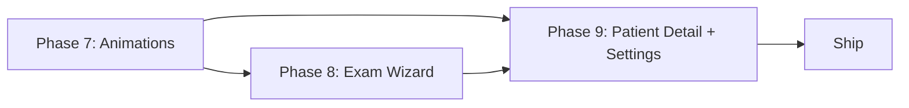

# Phase 9 — Doctor Patient Detail + Admin System Settings + Final Polish

## Pre-Implementation Analysis

### Validated Findings

| Question | Finding |
|----------|---------|
| `DoctorPatientEntry` fields | ✅ Has `chronicDiseases`, `allergies`, `currentMedicine`. ❌ Missing `dateOfBirth`, `bloodType` — no separate endpoint available |
| `GET /api/patients/{id}` (.NET) | ❌ Does not exist. Patient data must be extracted from the `patients[]` array returned by `doctorService.getDashboard()` |
| `reportService.fetchWarnings()` | ✅ Already exists (L103-108 of `reportService.ts`). Calls `GET /patient/{patientId}/warnings` on Python RAG |
| Admin settings page | ❌ No `admin/settings/` route exists yet |
| `user.userId` field | `user?.userId` via `useAuthStore()` — type `string` |
| Warnings endpoint shape | `{ status, patient_id, warnings: [{ type, severity, message }] }` — `type` can be `"allergy"`, `"drug_interaction"`, etc. |
| RAG auth headers | None — the Python RAG service has no auth middleware |
| Streaming vs JSON | All RAG endpoints return full JSON responses, no streaming |
| Existing UI components | `AnimatedNumber`, `AnimatedProgressBar`, `EmptyState`, `ErrorState`, `Skeleton`, `Typewriter`, `FileUploadZone`, `Logo`, `RevealOnScroll` — all available |
| Existing ANIM_CLASSES | `hidden`, `visible`, `scale`, `scaleIn`, `left`, `leftIn`, `right`, `rightIn`, `fadeUp`, `fadeUpIn`, `fadeDown`, `fadeDownIn` |

### Corrections to Original Plan

> [!WARNING]
> The original plan references `dateOfBirth` and `bloodType` on the patient detail page. These fields are **not available** in `DoctorPatientEntry` and there is no separate `.NET` endpoint to fetch them for the doctor role. The plan must be updated to omit these fields or show them as "N/A".

> [!IMPORTANT]
> The original plan mentions `reportService.getWarnings()` — the actual method name is **`reportService.fetchWarnings(patientId)`**.

> [!NOTE]
> The original plan references `Lucide AlertTriangle` icon. This project uses **Google Material Symbols** exclusively (loaded via CDN). The correct icon is `warning` from material-symbols-outlined.

---

## 9.1 — Doctor Patient Detail Page

### Route & Data Strategy

#### [NEW] `src/app/[locale]/(app)/doctor/patients/[patientId]/page.tsx`

**Data sourcing approach:** The page receives `patientId` from the URL. It calls `doctorService.getDashboard(user.userId)` and **filters** the returned `patients[]` array to find the matching `DoctorPatientEntry` where `entry.patientId === patientId`. This avoids needing a new backend endpoint.

> [!NOTE]
> Since `getDashboard()` returns **all** patients, the detail page will always have fresh data. If the patient is not found in the array (e.g. deleted appointment), the page shows an `ErrorState` with a "Go Back" button.

**Props available from `DoctorPatientEntry`:**
- `patientId: string`
- `patientName: string`
- `appointmentId: number`
- `reason: string`
- `appointmentDate: string`
- `medicalReport: string`
- `chronicDiseases: string[]`
- `allergies: string[]`
- `currentMedicine: string[]`

**Props NOT available (removed from plan):**
- ~~`dateOfBirth`~~ — not in `DoctorPatientEntry`
- ~~`bloodType`~~ — not in `DoctorPatientEntry`
- ~~`gender`~~ — not in `DoctorPatientEntry`
- ~~`age`~~ — not in `DoctorPatientEntry`

---

### Layout Sections

#### Section A — Patient Profile Card (top)

- Avatar circle with initials (gradient from existing `AVATAR_COLORS` pattern used in `doctor/page.tsx`)
- Patient name — `text-3xl font-bold text-on-surface`
- Metadata row: **Patient ID badge** (pill with `bg-primary/10 text-primary`) + **Last visit date** (formatted from `appointmentDate`)
- ~~age, gender, blood type~~ — **removed** (data not available)
- Animation: `anim-scale-in` on mount

#### Section B — Visit Snapshot Card

- Background: `bg-surface-container-low rounded-xl p-6 ambient-shadow`
- Shows: appointment reason, formatted date, appointment ID
- Status badge: "Scheduled" pill (same design as appointment cards in `doctor/appointments/page.tsx`)
- Data source: directly from the filtered `DoctorPatientEntry` — **no extra API call**
- Animation: `anim-fade-up-in`, 150ms delay

#### Section C — Action Buttons Row

Four pill buttons in a horizontal flex row (`flex flex-wrap gap-3`):

1. **View AI Report** — `bg-primary/10 text-primary rounded-full` — opens `<ReportDrawer />` inline (existing component, props: `patientId`, `patientName`, `onClose`)
2. **Run Examination** — `bg-tertiary/10 text-tertiary rounded-full` — `<Link>` to `/${locale}/doctor/examination?patientId=${patientId}&patientName=${encodeURIComponent(patientName)}`
3. **Mark Complete** — `bg-surface-container-high text-on-surface rounded-full` — calls `doctorService.completeAppointment({ appointmentId })`, shows spinner during request, disables after completion
4. **Send Message** — `bg-secondary/10 text-secondary rounded-full` — placeholder `onClick` shows toast "Coming soon"

Animation: stagger `anim-fade-up-in`, 80ms each

#### Section D — Clinical Medical Summary (3 cards)

Three side-by-side cards on desktop (`grid grid-cols-1 md:grid-cols-3 gap-6`), stacking on mobile:

| Card | Title | Data Source | Pill Color |
|------|-------|-------------|------------|
| Chronic Diseases | `dashboard.patient.chronicDiseases` | `entry.chronicDiseases[]` | `bg-secondary/10 text-secondary` |
| Allergies | `dashboard.patient.allergies` | `entry.allergies[]` | `bg-error-container text-error` |
| Current Medications | `dashboard.patient.medications` | `entry.currentMedicine[]` | `bg-primary/10 text-primary` |

Each card:
- Header: icon + title, `text-lg font-bold`
- Body: flex-wrap pills for each item
- Empty state: "No records" text with muted icon (reuses existing pill-color pattern from `doctor/appointments/page.tsx` L112-126)

Animation: left card `anim-left-in`, center `anim-fade-up-in`, right `anim-right-in` (simultaneous, 300ms delay from buttons)

#### Section E — Drug Interaction Warning Card

- Background: `bg-amber-50 dark:bg-amber-900/20 border border-amber-200 dark:border-amber-800 rounded-xl p-6`
- Header: `warning` icon from material-symbols-outlined + "Drug Interaction Warnings" title + "REVIEW REQUIRED" pill badge with `anim-ring-pulse`
- Body: bullet list of `warning.message` for each `PatientWarning` returned
- Each bullet is color-coded by `severity`:
  - `high` → `text-error` + filled dot
  - `medium` → `text-amber-700 dark:text-amber-300` + outlined dot
  - `low` → `text-on-surface-variant` + muted dot
- Grouping: warnings grouped by `warning.type` field (`"allergy"`, `"drug_interaction"`, etc.) — each group gets its own sub-header
- **Data source:** `reportService.fetchWarnings(patientId)` — existing method (L103-108 of `reportService.ts`)
- **Error handling:** If Python RAG is unreachable, shows an inline notice: "⚠️ AI Warning service is offline. Drug interaction checks are unavailable." with a Retry button
- **Loading state:** `<SkeletonRow />` (3 rows) while fetching

Animation: `anim-scale-in`, 400ms delay. Pills inside stagger 30ms each.

---

### Navigation Integration

#### [MODIFY] `src/app/[locale]/(app)/doctor/page.tsx`

In the `PatientRow` component (L46-84), wrap the patient name text in a `<Link>`:

```diff
- <p className="font-semibold text-on-surface text-sm group-hover:text-primary transition-colors truncate">{entry.patientName}</p>
+ <Link href={`/${locale}/doctor/patients/${entry.patientId}`} className="font-semibold text-on-surface text-sm group-hover:text-primary transition-colors truncate hover:underline">{entry.patientName}</Link>
```

The existing "Report" button is **preserved** (still opens the drawer from the dashboard).

#### [MODIFY] `src/app/[locale]/(app)/doctor/appointments/page.tsx`

In the `AppointmentCard` component (L46-168), wrap the patient name text in a `<Link>`:

```diff
- <p className="font-bold text-on-surface">{entry.patientName}</p>
+ <Link href={`/${locale}/doctor/patients/${entry.patientId}`} className="font-bold text-on-surface hover:text-primary hover:underline transition-colors">{entry.patientName}</Link>
```

The existing "View Report", "Run Examination", and "Mark Complete" buttons are **all preserved**.

---

### i18n Keys (new)

Add under `dashboard.doctor`:

```json
{
  "patientDetail": "Patient Detail",
  "visitSnapshot": "Visit Snapshot",
  "scheduledDate": "Scheduled Date",
  "reason": "Reason",
  "patientId": "Patient ID",
  "lastVisit": "Last Visit",
  "sendMessage": "Send Message",
  "comingSoon": "Coming soon",
  "drugWarnings": "Drug Interaction Warnings",
  "reviewRequired": "REVIEW REQUIRED",
  "warningServiceOffline": "AI Warning service is offline. Drug interaction checks are unavailable.",
  "noWarnings": "No active warnings detected.",
  "runExamination": "Run Examination",
  "chronicDiseases": "Chronic Diseases",
  "allergies": "Allergies",
  "currentMedications": "Current Medications",
  "noRecords": "No records",
  "completed": "Completed",
  "goBack": "Go Back",
  "patientNotFound": "Patient not found",
  "patientNotFoundSubtitle": "This patient may have been removed or the link is invalid."
}
```

Equivalent Arabic keys to be added under `dashboard.doctor` in `ar.json`.

---

### Verification Checklist (Section 9.1)

- [ ] `npm run lint` — 0 errors
- [ ] `npm run build` — 0 errors, new route `ƒ /[locale]/doctor/patients/[patientId]` appears
- [ ] Patient name in doctor dashboard → clickable, navigates to detail page
- [ ] Patient name in appointments page → clickable, navigates to detail page
- [ ] Profile card renders with initials avatar + name + patient ID badge
- [ ] Visit snapshot shows reason + date
- [ ] "View AI Report" button opens ReportDrawer
- [ ] "Run Examination" navigates to exam wizard with query params
- [ ] "Mark Complete" calls API, shows spinner, disables after success
- [ ] Clinical summary shows 3 cards with correct data and colors
- [ ] Drug warnings card loads from RAG, groups by type, color-codes by severity
- [ ] Drug warnings gracefully handles RAG offline with retry button
- [ ] Page works in both EN (LTR) and AR (RTL)
- [ ] Dark mode renders correctly

---

## 9.2 — Admin System Settings Page

### Route & Architecture

#### [NEW] `src/app/[locale]/(app)/admin/settings/page.tsx`

Matches Sebar `system_settings_page.dart` (Patch 5). Client component (`'use client'`) with 4-tab navigation.

**State management:** All settings persist to `localStorage` via the `useSettings()` hook from `src/lib/settings.ts` (Section 9.3). No backend endpoint exists — each admin browser maintains its own settings copy.

**Tab switching:** Active tab state managed via `useState<TabKey>`. Tab indicator slides using CSS `transition: transform 300ms` on a bottom-bar `<span>` positioned absolutely under the tab row.

---

### Tab Layout Structure

Outer container:
```
w-full max-w-5xl mx-auto space-y-6
```

Tab bar:
```
flex gap-1 bg-surface-container-high p-1 rounded-full w-fit overflow-x-auto
```
(Reuses the exact same filter-tabs pattern from `doctor/appointments/page.tsx` L265-283)

Tab content area:
```
bg-surface-container-lowest rounded-xl p-6 ambient-shadow ghost-border
```

---

### Tab 1 — General

| Setting | Type | Default | Persistence |
|---------|------|---------|-------------|
| Workspace name | Read-only text | "MediScan AI" | N/A |
| Default language | Toggle (AR / EN) | `ar` | `localStorage` |
| Default theme | 3-option selector (Light / Dark / System) | `system` | `localStorage` |
| AI Sensitivity | Slider (0–100) | `70` | `localStorage` |

**AI Sensitivity slider implementation:**
- Native `<input type="range" min={0} max={100} step={1} />`
- Track: gradient from `bg-primary/20` to `bg-primary`
- Thumb: custom-styled via CSS (`accent-color` or pseudo-element) — `w-5 h-5 rounded-full bg-primary shadow-lg`
- Value tooltip: shows current value above the thumb while dragging
- Thumb scales `1.2×` on `:active` (CSS `transform: scale(1.2)`)
- On change: calls `saveSettings({ aiSensitivity: value })`

**Save changes button:**
- `signature-gradient text-white rounded-full py-3 px-8`
- Shows toast "Settings saved" on click (all settings auto-persist on change, button is UX confirmation)

---

### Tab 2 — Security

Toggle setting cards (each is a row with label + toggle switch):

| Setting | Key | Default |
|---------|-----|--------|
| Require email verification on registration | `requireEmailVerification` | `true` |
| Enable two-factor auth | `enableTwoFactor` | `false` |
| Auto-logout idle session | `autoLogoutMinutes` | `30` |
| Strict password policy (min 8 + symbol + number) | `strictPasswordPolicy` | `true` |

**Auto-logout selector:** Dropdown/segmented control with options `5 | 15 | 30 | 60` minutes.

**Toggle switch component:** Reuses the same toggle pattern from the examination hub page (`examinations/page.tsx`) — `w-14 h-8 rounded-full` track with `w-6 h-6 rounded-full` thumb, `translate-x-6` on active.

**Audit log section:**
- Card with `bg-surface-container-low rounded-xl p-6`
- Title: "Audit Log"
- Body: `<EmptyState>` component with icon `history` and text "No audit events recorded yet."
- Read-only placeholder — no API backing

---

### Tab 3 — Integrations

Cards for connected services with live status indicators:

| Service | URL Source | Health Check Method |
|---------|-----------|--------------------|
| .NET Backend | `NEXT_PUBLIC_API_BASE_URL` (env var, defaults to `https://localhost:7196/api`) | `HEAD` request to base URL — any 2xx/3xx/4xx = reachable, network error = unreachable |
| Python RAG | `NEXT_PUBLIC_RAG_URL` (env var, defaults to `http://localhost:8005`) | `GET /health` — expects `{"status": "healthy"}` |
| Email Provider | N/A | Static placeholder — always shows "Not configured" |

**Status dot styling:**
- Reachable: `w-3 h-3 rounded-full bg-green-500 anim-ring-pulse`
- Unreachable: `w-3 h-3 rounded-full bg-red-500`
- Checking: `w-3 h-3 rounded-full bg-amber-400 animate-pulse`

**Auto-refresh:** `useEffect` with `setInterval(30_000)` — re-pings all services every 30 seconds. Cleanup on unmount.

**Retry button:** Each unreachable service shows a small "Retry" text button that triggers an immediate re-ping.

> [!NOTE]
> Health checks use raw `fetch()` / `axios.head()` calls directly (not through `apiClient` which adds auth headers). The .NET check uses the same base URL from `process.env.NEXT_PUBLIC_API_BASE_URL`. The RAG check uses `process.env.NEXT_PUBLIC_RAG_URL` (same env var used by `reportService.ts` L17).

---

### Tab 4 — Notifications

**Language usage bars:**
- Two `<AnimatedProgressBar>` components (existing, from `src/components/ui/AnimatedProgressBar.tsx`)
- Arabic: `progress={72}` `label="Arabic"` `colorClass="bg-primary"` (hardcoded sample)
- English: `progress={28}` `label="English"` `colorClass="bg-tertiary"` (hardcoded sample)
- Note in UI: "Based on sample data — analytics integration pending"

**Per-event notification toggles:**

| Event | Key | Default |
|-------|-----|--------|
| New patient registered | `notifications.newPatient` | `true` |
| Doctor deactivated | `notifications.doctorDeactivated` | `true` |
| Appointment confirmed/cancelled | `notifications.appointmentUpdate` | `true` |
| AI diagnosis completed | `notifications.aiDiagnosis` | `false` |
| Report generated | `notifications.reportGenerated` | `true` |

Each toggle uses the same switch component as Tab 2.

---

### Bottom Section — Role Governance

- **User search bar:** `<input>` with `bg-surface-container-low rounded-full px-4 py-3` + search icon
- **User list:** Placeholder with 3 sample rows (hardcoded): each shows name + email + role pill badge
- **Role change:** Each row has a "Change Role" button that opens a confirmation modal (dialog with `role="dialog" aria-modal="true"`) — modal shows "This feature is not yet available" + Close button
- Documented clearly as future work in the UI

---

### Animation Script

- Tab content: `anim-fade-up-in` on tab switch (200ms)
- Active tab indicator: CSS `transition: transform 300ms ease` sliding bar
- Sliders: thumb `:active { transform: scale(1.2) }`
- Toggle switches: `transition-colors 200ms` on track + `transition-transform 200ms` on thumb
- Connection dots: `anim-ring-pulse` class on reachable status
- Language usage bars: `<AnimatedProgressBar>` triggers animation when tab becomes visible (uses `useInView` internally)

---

### SideNavBar Integration

#### [MODIFY] `src/components/layout/SideNavBar.tsx`

Add settings nav item to the Admin section of `NAV_ITEMS` array (after `bookAppointment`, before the array closing bracket):

```diff
  { key: 'bookAppointment', icon: 'calendar_add_on', href: '/admin/book-appointment', roles: ['Admin'] },
+ { key: 'settings',        icon: 'settings',        href: '/admin/settings',        roles: ['Admin'] },
```

> [!NOTE]
> The `settings` key already exists in `nav.*` translations (en.json L179: `"settings": "Settings"`). No new nav i18n key is needed. The same key is already used by the footer Settings link, which will remain as-is for Patient/Doctor roles.

---

### i18n Keys (new)

Add new `settings` section in both `en.json` and `ar.json`:

```json
{
  "settings": {
    "title": "System Settings",
    "subtitle": "Configure platform behavior and integrations.",
    "general": "General",
    "security": "Security",
    "integrations": "Integrations",
    "notifications": "Notifications",
    "workspaceName": "Workspace Name",
    "defaultLanguage": "Default Language",
    "defaultTheme": "Default Theme",
    "light": "Light",
    "dark": "Dark",
    "system": "System",
    "aiSensitivity": "AI Sensitivity",
    "aiSensitivityDesc": "Controls the diagnostic confidence threshold for AI services.",
    "saveChanges": "Save Changes",
    "saved": "Settings saved",
    "requireEmailVerification": "Require Email Verification",
    "enableTwoFactor": "Enable Two-Factor Auth",
    "autoLogout": "Auto-Logout After Idle",
    "minutes": "minutes",
    "strictPassword": "Strict Password Policy",
    "auditLog": "Audit Log",
    "noAuditEvents": "No audit events recorded yet.",
    "connectedServices": "Connected Services",
    "reachable": "Reachable",
    "unreachable": "Unreachable",
    "checking": "Checking...",
    "retry": "Retry",
    "notConfigured": "Not configured",
    "languageUsage": "Language Usage",
    "sampleDataNote": "Based on sample data — analytics integration pending.",
    "eventNotifications": "Event Notifications",
    "newPatient": "New patient registered",
    "doctorDeactivated": "Doctor deactivated",
    "appointmentUpdate": "Appointment confirmed/cancelled",
    "aiDiagnosis": "AI diagnosis completed",
    "reportGenerated": "Report generated",
    "roleGovernance": "Role Governance",
    "searchUsers": "Search users...",
    "changeRole": "Change Role",
    "featureNotAvailable": "This feature is not yet available.",
    "close": "Close"
  }
}
```

---

## 9.3 — Settings Persistence Helper

### [NEW] `src/lib/settings.ts`

```typescript
export interface PlatformSettings {
  aiSensitivity: number;                    // 0–100, default 70
  defaultLanguage: 'ar' | 'en';            // default 'ar'
  defaultTheme: 'light' | 'dark' | 'system'; // default 'system'
  requireEmailVerification: boolean;        // default true
  enableTwoFactor: boolean;                 // default false
  autoLogoutMinutes: 5 | 15 | 30 | 60;     // default 30
  strictPasswordPolicy: boolean;            // default true
  notifications: Record<string, boolean>;   // per-event toggle map
}

export const defaultSettings: PlatformSettings = {
  aiSensitivity: 70,
  defaultLanguage: 'ar',
  defaultTheme: 'system',
  requireEmailVerification: true,
  enableTwoFactor: false,
  autoLogoutMinutes: 30,
  strictPasswordPolicy: true,
  notifications: {
    newPatient: true,
    doctorDeactivated: true,
    appointmentUpdate: true,
    aiDiagnosis: false,
    reportGenerated: true,
  },
};

export function loadSettings(): PlatformSettings;
export function saveSettings(patch: Partial<PlatformSettings>): void;
export function useSettings(): [PlatformSettings, (patch: Partial<PlatformSettings>) => void];
```

**Implementation details:**
- `loadSettings()`: Reads from `localStorage.getItem('mediscan_platform_settings')`, merges with `defaultSettings` to handle missing keys from older versions
- `saveSettings()`: Deep merges patch into existing settings, writes full object to `localStorage`
- `useSettings()` hook: Uses `useState` + `useEffect` with `storage` event listener for **cross-tab sync** — if another browser tab changes settings, this tab updates immediately
- SSR-safe: All `localStorage` access guarded by `typeof window !== 'undefined'`

### Integration Points

#### [MODIFY] `src/services/aiService.ts`

Read `aiSensitivity` from settings and pass as a custom header:

```diff
+ import { loadSettings } from '@/lib/settings';

  function buildImageForm(file: File, userRole: string): FormData {
    const form = new FormData();
    form.append('Image', file);
    form.append('UserRole', userRole);
    return form;
  }

+ function getAiHeaders(): Record<string, string> {
+   if (typeof window === 'undefined') return {};
+   const { aiSensitivity } = loadSettings();
+   return { 'X-AI-Sensitivity': String(aiSensitivity) };
+ }
```

Then in each diagnosis method, spread `getAiHeaders()` into the request headers. The backend will ignore headers it doesn't recognize — this is a **graceful no-op** until the backend adds support.

#### [MODIFY] `src/lib/axios.ts`

Read `autoLogoutMinutes` from settings and implement idle timeout:

```diff
+ import { loadSettings } from '@/lib/settings';

// After existing interceptors, add idle timeout logic:
+ if (typeof window !== 'undefined') {
+   let idleTimer: ReturnType<typeof setTimeout>;
+   const resetIdle = () => {
+     clearTimeout(idleTimer);
+     const { autoLogoutMinutes } = loadSettings();
+     idleTimer = setTimeout(() => {
+       document.cookie = 'mediscan_token=; Max-Age=0; path=/';
+       const locale = window.location.pathname.startsWith('/en') ? 'en' : 'ar';
+       window.location.href = `/${locale}/login`;
+     }, autoLogoutMinutes * 60_000);
+   };
+   ['mousemove', 'keydown', 'click', 'scroll'].forEach(e => window.addEventListener(e, resetIdle));
+   resetIdle();
+ }
```

> [!WARNING]
> The idle timeout fires a hard redirect to `/login`. This is destructive — any unsaved form data will be lost. The original plan accepts this behavior. Consider adding a warning toast 60 seconds before logout in a future iteration.

---

### Verification Checklist (Section 9.2 + 9.3)

- [ ] `npm run lint` — 0 errors
- [ ] `npm run build` — 0 errors, new route `ƒ /[locale]/admin/settings` appears
- [ ] Admin sidebar shows "Settings" nav item with `settings` icon
- [ ] Tab 1: AI sensitivity slider drags smoothly, persists value on page reload
- [ ] Tab 1: Theme toggle changes `<html>` class, persists
- [ ] Tab 2: All toggles persist to localStorage, cross-tab sync works
- [ ] Tab 2: Auto-logout minute selector changes value
- [ ] Tab 3: .NET health check shows green/red dot correctly
- [ ] Tab 3: Python RAG health check shows green/red dot correctly
- [ ] Tab 3: Auto-refresh pings every 30s
- [ ] Tab 4: AnimatedProgressBar renders language usage bars
- [ ] Tab 4: Notification toggles persist
- [ ] Role governance modal shows "not available" message
- [ ] All tabs work in EN (LTR) and AR (RTL)
- [ ] Dark mode renders correctly on all tabs

---

## 9.4 — Final Polish Pass

### Accessibility Audit

Based on the codebase scan, here is the current state and what needs fixing:

#### Focus Rings

**Current state:** No `focus-visible` classes found anywhere in the codebase. Interactive elements (buttons, links, inputs) rely on browser defaults which are often invisible in Chrome.

**Action required:** Add a global focus-visible utility in `globals.css`:

```css
/* Global focus ring — primary color, visible only on keyboard nav */
:focus-visible {
  outline: 2px solid var(--md-sys-color-primary);
  outline-offset: 2px;
  border-radius: inherit;
}
```

This automatically applies to **all** interactive elements without touching individual component files. The `border-radius: inherit` ensures it follows the element's shape (pills, circles, etc.).

#### Dialog/Drawer Accessibility

**Current state:** Only `ReportDrawer.tsx` has `role="dialog"` and `aria-modal="true"`. The `NotificationPanel` and any modals in admin pages may lack these.

**Action required:**
- Audit `NotificationPanel.tsx` — add `role="dialog"`, `aria-modal="true"`, and Escape key handler if missing
- The new admin settings role-governance modal (Section 9.2) must include these from the start
- All dialogs/drawers must trap focus (first focusable element receives focus on open, Tab cycles within the dialog)

#### Minimum Tap Target Size

**Current state:** Most buttons use `py-2 px-4` or `py-3 px-5` which generally meets 44×44px. However, small icon-only buttons (e.g., notification bell in `doctor/page.tsx` L150: `p-2 rounded-full`) may fall below the 44px threshold.

**Action required:** Audit all icon-only buttons and ensure minimum `w-11 h-11` (44px) tap area. If the visual needs to stay small, use an invisible padding wrapper.

#### Skip-to-Content Link

**Action required:** Add a visually-hidden skip link as the first element in the app shell layout (`src/app/[locale]/(app)/layout.tsx`):

```tsx
<a href="#main-content" className="sr-only focus:not-sr-only focus:absolute focus:z-[999] focus:top-4 focus:start-4 focus:bg-primary focus:text-on-primary focus:px-4 focus:py-2 focus:rounded-full focus:font-semibold">
  Skip to content
</a>
```

And add `id="main-content"` to the main content area.

#### Screen Reader Support

**Current state:** `ReportDrawer` already has `aria-label`. The `ExamTimer` uses visual countdown but no `aria-live` region.

**Action required:**
- Add `aria-live="polite"` to the ExamTimer countdown text so screen readers announce time changes
- Ensure all form inputs have associated `<label>` elements (or `aria-label` attributes)

#### Reduced Motion

**Current state:** ✅ Already handled. `globals.css` L216-228 includes a comprehensive `@media (prefers-reduced-motion: reduce)` block that disables all custom animations and sets `transition-duration: 0.01ms`. The hooks in `animations.ts` (`useCountUp`, `useTypewriter`) also check `window.matchMedia('(prefers-reduced-motion: reduce)')`.

**No action required** — this is already complete.

---

### Performance Audit

#### Target Metrics
| Metric | Target | Current Estimate |
|--------|--------|-----------------|
| Lighthouse Performance | ≥ 90 | ~85-90 (needs verification) |
| Lighthouse Accessibility | ≥ 95 | ~80-85 (focus rings missing) |
| LCP | < 2.5s | Should pass (SSR + minimal above-fold JS) |
| CLS | = 0 | Should pass (animations use `transform` only) |
| TBT | < 200ms | Needs measurement |

#### Image Optimization

**Action required:**
- Verify all `next/image` uses include explicit `width` and `height` props
- Above-the-fold images (logos, hero) should have `priority` attribute
- The exam GIFs use `unoptimized` (necessary for animation) — this is acceptable

#### Font Loading

**Current state:** Fonts are loaded via Google Fonts CDN in the root layout. Verify `font-display: swap` is set on all `@font-face` declarations.

**Action required:** Check the `<link>` tags for Google Fonts include `&display=swap` parameter.

#### Bundle Size

**Action required:** Run `npx next build` with `ANALYZE=true` (if `@next/bundle-analyzer` is installed) to check chunk sizes.

Lazy-load heavy components using `next/dynamic`:
- `ReportDrawer` — only loaded when doctor clicks "View Report"
- `ExamWizard` — only loaded on exam route pages
- `NotificationPanel` — only loaded when bell icon is clicked

Example:
```tsx
const ReportDrawer = dynamic(() => import('@/components/doctor/ReportDrawer').then(m => m.ReportDrawer), { ssr: false });
```

---

### Bug Sweep / UX Consistency

#### Loading States Audit

**Current state:** The project uses **two patterns** for loading:
1. `<SkeletonRow />` / `<SkeletonCard />` — used in doctor dashboard, appointments, admin dashboard ✅
2. Inline `animate-spin` border spinners — used in buttons during async operations (22 instances across 14 files) ✅

**Assessment:** Both patterns are appropriate for their contexts — skeletons for page-level loading, spinners for button-level actions. **No change needed** — the spinners are consistent in style (border-based, `rounded-full`).

> [!NOTE]
> The original plan says "replace any ad-hoc spinners with Skeleton." This is incorrect — button spinners and page skeletons serve different purposes. Keep both.

#### Empty States Audit

**Current state:** The `<EmptyState>` component exists (`src/components/ui/EmptyState.tsx`) with props `{ icon, title, subtitle, action }`. However, some pages use **ad-hoc empty states** (inline `<div>` with icon + text) instead of the reusable component.

**Files using ad-hoc empty states (should migrate):**
- `doctor/page.tsx` L248-251 (Today's schedule) and L298-302 (Patient registry)
- `doctor/appointments/page.tsx` L307-316
- `admin/page.tsx` (Today's appointments empty state)

**Action:** Low priority — these ad-hoc states are visually consistent even if not using the shared component. Migration is nice-to-have but not blocking.

#### Error States Audit

**Current state:** The `<ErrorState>` component exists (`src/components/ui/ErrorState.tsx`) with props `{ message, onRetry }`. Most pages use **inline error blocks** instead (`bg-error-container text-error` divs).

**Assessment:** Same as empty states — visually consistent but not using the shared component. Low-priority migration.

#### Toast System

**Current state:** Toasts are implemented **inline per page** — each page has its own `const [toast, setToast]` state + `setTimeout(3000)` + absolute-positioned div. There is **no shared Toast provider**.

**Action:** Creating a shared toast provider is desirable but is a **cross-cutting change** affecting many files. Recommend documenting as future work rather than doing it in Phase 9 to avoid regression risk.

#### Modal Close Behavior

**Current state:** `ReportDrawer` closes on Escape (L206-209) and backdrop click (L250). New modals in Phase 9 should follow this same pattern.

**Action:** Ensure the role-governance placeholder modal in admin settings also handles Escape + backdrop click.

---

### Documentation Pass

#### [MODIFY] `README.md`

Update to include Phase 7/8/9 routes. Add a route table showing the final ~36 routes.

#### [NEW] `docs/ANIMATIONS.md`

Document the animation framework:
- Available `ANIM_CLASSES` entries and their CSS equivalents
- How to use `staggerDelay(index, base, cap)`
- How `useInView`, `useCountUp`, `useTypewriter` hooks work
- How `prefers-reduced-motion` is handled
- Per-page animation scripts (which page uses which animations)

#### [NEW] `docs/EXAM_WIZARD.md`

Document how to add new exam flows:
- `ExamStep` type interface
- How to create a new step array in `exam-steps.ts`
- How `ExamWizard` accepts `steps[]` and `variant`
- How `ExamStepCard` renders media (GIF vs video vs icon)
- How to add new i18n keys for exam steps

---

## 9.5 — File Summary (Phase 9)

| Action | Path | Section |
|--------|------|---------|
| NEW | `src/app/[locale]/(app)/doctor/patients/[patientId]/page.tsx` | 9.1 |
| NEW | `src/app/[locale]/(app)/admin/settings/page.tsx` | 9.2 |
| NEW | `src/lib/settings.ts` | 9.3 |
| NEW | `docs/ANIMATIONS.md` | 9.4 |
| NEW | `docs/EXAM_WIZARD.md` | 9.4 |
| MODIFY | `src/app/[locale]/(app)/doctor/page.tsx` — patient name links to detail | 9.1 |
| MODIFY | `src/app/[locale]/(app)/doctor/appointments/page.tsx` — patient name links to detail | 9.1 |
| MODIFY | `src/components/layout/SideNavBar.tsx` — add admin Settings nav item | 9.2 |
| MODIFY | `src/services/aiService.ts` — read `aiSensitivity` from settings | 9.3 |
| MODIFY | `src/lib/axios.ts` — read `autoLogoutMinutes` from settings, idle timeout | 9.3 |
| MODIFY | `src/app/globals.css` — add `:focus-visible` global rule | 9.4 |
| MODIFY | `src/app/[locale]/(app)/layout.tsx` — add skip-to-content link | 9.4 |
| MODIFY | `messages/en.json` — add settings + patient detail keys | 9.1, 9.2 |
| MODIFY | `messages/ar.json` — add settings + patient detail keys | 9.1, 9.2 |
| MODIFY | `README.md` — update route table | 9.4 |

**Total: ~5 new files, ~10 modified files**

---

## 9.6 — Open Questions (Phase 9)

> [!IMPORTANT]
> **Q1 — Backend persistence for admin settings:** No `.NET` endpoint exists for system-wide admin settings. All settings are stored in `localStorage` (per-browser, per-admin). When multiple admins exist, each sees their own settings independently. Is this acceptable for the graduation project scope, or do you want a backend endpoint added?

> [!IMPORTANT]
> **Q2 — Drug interaction grouping:** The Python RAG `GET /patient/{patientId}/warnings` endpoint returns warnings with a `type` field (`"allergy"`, `"drug_interaction"`, etc.). The plan groups warnings by this `type` field with sub-headers. Should we also show a severity count summary (e.g., "3 High, 2 Medium") at the top of the warnings card?

> [!NOTE]
> **Q3 — Toast provider migration:** Creating a shared toast context would touch ~8 existing pages. Should this be done in Phase 9 or deferred to avoid regression risk?

> [!NOTE]
> **Q4 — EmptyState/ErrorState migration:** Several pages use visually-consistent but ad-hoc empty/error states instead of the shared components. Should we migrate them in Phase 9, or leave them as-is since they're already visually consistent?

---

## 9.7 — Verification (Phase 9)

### Build Verification

```bash
npm run lint    # Exit 0, 0 errors, 0 warnings
npm run build   # Exit 0, all routes compile
```

**Expected new routes:**
```
ƒ /[locale]/doctor/patients/[patientId]
ƒ /[locale]/admin/settings
```

**Final route count after Phase 9:** ~36 routes

### Manual Verification Checklist

**Section 9.1 — Patient Detail:**
- [ ] Navigate from doctor dashboard → click patient name → detail page loads
- [ ] Navigate from appointments page → click patient name → detail page loads
- [ ] Profile card shows initials, name, patient ID badge, last visit date
- [ ] Visit snapshot shows reason + formatted date
- [ ] "View AI Report" opens ReportDrawer correctly
- [ ] "Run Examination" navigates to exam wizard with query params
- [ ] "Mark Complete" calls API, spinner during request, button disabled after
- [ ] Clinical summary 3 cards render with correct colors and data
- [ ] Drug warnings load from RAG service when available
- [ ] Drug warnings show offline notice when RAG is unreachable
- [ ] Page handles missing patient (bad URL) with ErrorState + Go Back button

**Section 9.2 — Admin Settings:**
- [ ] Admin sidebar shows Settings item
- [ ] Tab switching animates smoothly
- [ ] AI sensitivity slider persists value across page reload
- [ ] Theme toggle works (Light / Dark / System)
- [ ] Security toggles persist to localStorage
- [ ] Auto-logout minute selector changes active value
- [ ] Integrations tab shows live .NET health check status
- [ ] Integrations tab shows live RAG health check status
- [ ] Health checks auto-refresh every 30s
- [ ] Language usage bars animate on tab activation
- [ ] Notification toggles persist
- [ ] Role governance modal shows placeholder message

**Section 9.3 — Settings Integration:**
- [ ] Change `autoLogoutMinutes` → idle redirect respects new value
- [ ] Cross-tab sync: change setting in Tab A → Tab B updates
- [ ] SSR doesn't crash (no `localStorage` access on server)

**Section 9.4 — Polish:**
- [ ] Focus rings visible on keyboard Tab navigation
- [ ] Skip-to-content link appears on Tab press
- [ ] Dark mode correct on all new pages
- [ ] RTL layout correct on all new pages
- [ ] `prefers-reduced-motion` disables all animations

### Automated Verification

```bash
# Lighthouse (requires Chrome + lighthouse CLI)
npx lighthouse http://localhost:3000/en/doctor --output json --quiet
# Check: performance >= 90, accessibility >= 95
```

---

## Cross-Phase Dependencies



Phase 9 is the **final phase**. After completion, the web platform reaches feature parity with the Sebar Flutter app for all patches (3, 4, 5, 6) — except for backend persistence of admin settings and clinical examination results, both documented as future work with `localStorage` fallbacks.
